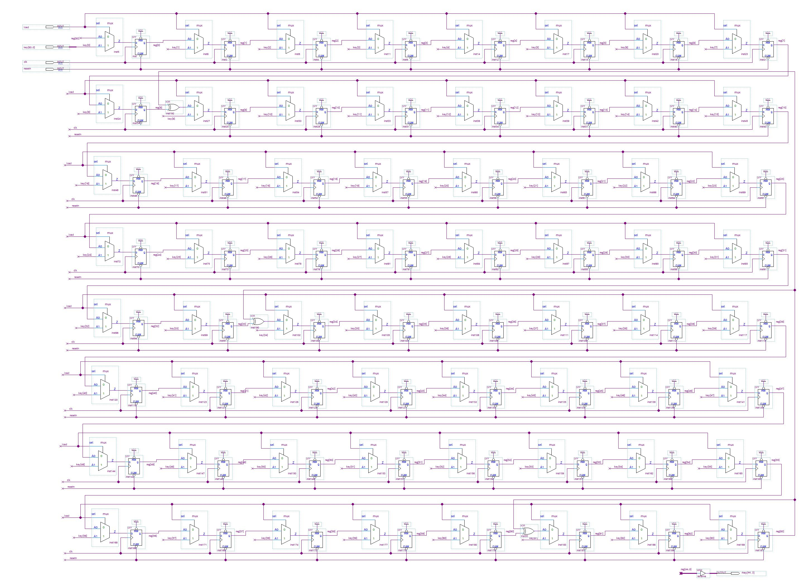

# Evil Cipher

---

## Description

Evil Country a développé et implémenté sur FPGA son propre algorithme de chiffrement par blocs de 45 bits avec une clé de 64 bits. cipher.txt est un message chiffré avec la clé key=0x4447534553494545. Un agent a réussi à récupérer

* le code VHDL de l'algorithme (evil_cipher.vhd)
* la fin du package VHDL utilisé (extrait_galois_field.vhd)
* le schéma de la fonction permutation15 (permutation15.jpg)
* le schéma du composant key_expansion (key_expansion.jpg)

Un exemple de texte chiffré se trouve dans le fichier evil_example.txt (dans l'archive zip)

Déchiffrez le message.

Le flag est de la forme DGSESIEE{x} avec x un hash

## Resources

* evil_cipher.vhd :

```vhdl
LIBRARY ieee;
USE ieee.std_logic_1164.ALL;
USE ieee.numeric_std.ALL;
USE work.galois_field.ALL;

--------------------------------------------
-- Operations dans GF(32)
-- avec le polynome : X^5+ X^2 +1
--------------------------------------------

ENTITY evil_cipher IS
  PORT (
    clk : IN STD_LOGIC;
    resetn : IN STD_LOGIC;
    start : IN STD_LOGIC;
    key : IN STD_LOGIC_VECTOR(63 DOWNTO 0);
    din : IN STD_LOGIC_VECTOR(44 DOWNTO 0);
    dout : OUT STD_LOGIC_VECTOR(44 DOWNTO 0);
    ready : OUT STD_LOGIC
  );
END ENTITY;

ARCHITECTURE rtl OF evil_cipher IS
  TYPE state IS (idle, cipher);
  SIGNAL current_state : state;
  SIGNAL next_state : state;
  SIGNAL reg_data : STD_LOGIC_VECTOR(din'RANGE);
  SIGNAL rkey : STD_LOGIC_VECTOR(din'RANGE);
  SIGNAL ctr : NATURAL RANGE 0 TO 5;
  SIGNAL load : STD_LOGIC;
  SIGNAL busy : STD_LOGIC;

BEGIN
  ready <= NOT busy;
  dout <= (OTHERS => '0') WHEN busy = '1'
    ELSE
    reg_data;

  PROCESS (clk, resetn) IS
  BEGIN
    IF resetn = '0' THEN
      current_state <= idle;
      reg_data <= (OTHERS => '0');
      ctr <= 0;

    ELSIF rising_edge(clk) THEN
      -- state register
      current_state <= next_state;

      -- counter
      IF busy = '0' OR ctr = 5 THEN
        ctr <= 0;
      ELSE
        ctr <= ctr + 1;
      END IF;

      -- data register
      IF busy = '1' THEN
        IF ctr = 0 THEN
          reg_data <= rkey XOR reg_data;
        ELSE
          reg_data <= round(reg_data, rkey);
        END IF;
      ELSIF load = '1' THEN
        reg_data <= din;
      END IF;
    END IF;
  END PROCESS;

  exp : ENTITY work.key_expansion
    PORT MAP(
      resetn => resetn,
      clk => clk,
      load => load,
      key => key,
      rkey => rkey
    );

  PROCESS (current_state, start, ctr) IS
  BEGIN
    CASE current_state IS
      WHEN idle =>
        IF start = '1' THEN
          next_state <= cipher;
        ELSE
          next_state <= idle;
        END IF;
        busy <= '0';
        load <= start;
      WHEN cipher =>
        IF ctr < 5 THEN
          next_state <= cipher;
        ELSE
          next_state <= idle;
        END IF;
        busy <= '1';
        load <= '0';
    END CASE;
  END PROCESS;
END ARCHITECTURE;
```

* extrait_galois_field.vhd :

```vhdl
--------------------------------------------
-- Operations dans GF(32)
-- avec le polynome : X^5+ X^2 +1
--------------------------------------------

FUNCTION permutation (a : STD_LOGIC_VECTOR(44 DOWNTO 0)) RETURN STD_LOGIC_VECTOR IS
  VARIABLE b : STD_LOGIC_VECTOR(44 DOWNTO 0);
BEGIN
  b(14 DOWNTO 0) := permutation15(a(29 DOWNTO 15));
  b(29 DOWNTO 15) := permutation15(a(44 DOWNTO 30));
  b(44 DOWNTO 30) := permutation15(a(14 DOWNTO 0));
  RETURN b;
END permutation;

FUNCTION round (d : STD_LOGIC_VECTOR(44 DOWNTO 0); key : STD_LOGIC_VECTOR(44 DOWNTO 0)) RETURN t_block IS
  VARIABLE tmp : STD_LOGIC_VECTOR(44 DOWNTO 0);
  VARIABLE data : STD_LOGIC_VECTOR(44 DOWNTO 0);
BEGIN
  tmp := permutation (d);
  FOR i IN 0 TO 8 LOOP
    tmp(5 * i + 4 DOWNTO 5 * i) := galois_inverse(tmp(5 * i + 4 DOWNTO 5 * i));
  END LOOP;

  tmp := tmp XOR key;

  FOR i IN 0 TO 2 LOOP
    data (15 * i + 4 DOWNTO 15 * i) :=
      tmp (15 * i + 4 DOWNTO 15 * i) XOR
      tmp (15 * i + 9 DOWNTO 15 * i + 5) XOR
      galois_multiplication(tmp(15 * i + 14 DOWNTO 15 * i + 10), "00010");

    data (15 * i + 9 DOWNTO 15 * i + 5) :=
      tmp (15 * i + 4 DOWNTO 15 * i) XOR
      galois_multiplication(tmp (15 * i + 9 DOWNTO 15 * i + 5), "00010") XOR
      tmp (15 * i + 14 DOWNTO 15 * i + 10);

    data (15 * i + 14 DOWNTO 15 * i + 10) :=
      galois_multiplication(tmp (15 * i + 4 DOWNTO 15 * i), "00010") XOR
      tmp (15 * i + 9 DOWNTO 15 * i + 5) XOR
      tmp (15 * i + 14 DOWNTO 15 * i + 10);
  END LOOP;

  RETURN data;
END round;

END galois_field;
```

* permutation15.jpg :


* key_expansion.jpg :


* cipher.txt :

```txt
100100110001011010001010011110100010001101110011111011001000101000001111000000101101111100101011011110011001000111001111010000011011111011110101111010100010011011101101000000001001110110111010101110111111001000010000110100010100010000110000101100011101111001111100000111001101101111000001110101010111000001001001101
010111101111101000100001111000001001100111111101111010000011100111100000101100010101000110100000000011101101111110010100111111101100110001110100110101101111100111001011110110100011101100111001000111101110101010110111011110010100010000011111101011101110101111110100111011110100100100111001010001010101001011001010100110101000010110000000101101100000101000011000101111110100111100000100110101001010100110011111011101001110110010011100011000100110000011
```

* evil_example.txt :

```txt
Exemple de chiffrement avec la clé 0x4447534553494545

texte clair :
evil

bloc clair équivalent:
011001010111011001101001011011000000000000000

bloc chiffré:
000101110010110001110101010111010101001010100
```

## Resolution

### Analyze

The evil_cipher.vhd file is the structure of the cipher algorithm.
At each tick of the clock, the data is cipher one time. At the end, the 45-bits input data is xor one time with rkey, then round five times.
The round function is in the extrait_galois_field.vhd file, using the rkey.

Meanwhile the rkey is calcul with hardware given in the key_expansion.jpg. The key is loaded just before the first cipher, then expend at each tick. The rkey is just the first 45-bits of the key.

The round function can be parted in 4 part. First, 3 x 15-bits of the data is permuted with the hardware given in the file permutation15.jpg. Then all 5 bits are inverted in the Galois Field 2^5 and the polynome x^5^+x^2^+1. Then, the data is xorred with rkey.Finaly, 15-bits blocs of data is mixed with xorring and GF multiplicity.

### Solution

The reverse is not possible because of the last action, but we can notify the data is process in 15-bits blocs. Brute force 2^15 combination is doable. All we need to do is reproduce the cipher, check if the cipher is correct with the example and then brute force.

```python
from pyfinite import ffield

#Texts to uncipher
t0 = 0b000101110010110001110101010111010101001010100
t1 = 0b100100110001011010001010011110100010001101110011111011001000101000001111000000101101111100101011011110011001000111001111010000011011111011110101111010100010011011101101000000001001110110111010101110111111001000010000110100010100010000110000101100011101111001111100000111001101101111000001110101010111000001001001101
t2 = 0b010111101111101000100001111000001001100111111101111010000011100111100000101100010101000110100000000011101101111110010100111111101100110001110100110101101111100111001011110110100011101100111001000111101110101010110111011110010100010000011111101011101110101111110100111011110100100100111001010001010101001011001010100110101000010110000000101101100000101000011000101111110100111100000100110101001010100110011111011101001110110010011100011000100110000011

key = 0x4447534553494545
rkeys = []

KEYMAX = 0xFFFFFFFFFFFFFFFF # 64 bits
RKEYMAX = 0x1FFFFFFFFFFF # 45 bits
BLOCMAX = 0x7FFF # 15 bits

#GF(32)
#polynome : X^5+ X^2 +1
MODULO = 32
POLYNOME = 0b100101
F = ffield.FField(5, gen=POLYNOME, useLUT=1) # create the field GF(2^5)


def key_expansion(k):
    #get high bit
    bit63 = k >> 63

    #shift
    k = ((k << 1) & KEYMAX) | bit63

    #xorring
    k = k ^ (bit63 << 61)
    k = k ^ (bit63 << 34)
    k = k ^ (bit63 << 9)
    return k


def get_rkey(k):
    return (k & RKEYMAX) #first 45 bits
def perm15(d):
    p = 0
    p = (p << 1) | ((d & 2**6) >> 6)   #14
    p = (p << 1) | ((d & 2**4) >> 4)   #13
    p = (p << 1) | ((d & 2**1) >> 1)   #12
    p = (p << 1) | ((d & 2**9) >> 9)   #11
    p = (p << 1) | ((d & 2**11) >> 11) #10
    p = (p << 1) | ((d & 2**14) >> 14) #9
    p = (p << 1) | (d & 2**0)          #8
    p = (p << 1) | ((d & 2**5) >> 5)   #7
    p = (p << 1) | ((d & 2**2) >> 2)   #6
    p = (p << 1) | ((d & 2**10) >> 10) #5
    p = (p << 1) | ((d & 2**12) >> 12) #4
    p = (p << 1) | ((d & 2**8) >> 8)   #3
    p = (p << 1) | ((d & 2**13) >> 13) #2
    p = (p << 1) | ((d & 2**3) >> 3)   #1
    p = (p << 1) | ((d & 2**7) >> 7)   #0
    return p


def multi(d):
    g1 = d & 0x1F
    d = d >> 5
    g2 = d & 0x1F
    d = d >> 5
    g3 = d

    mg1 = F.Multiply(g1, 0b00010)
    mg2 = F.Multiply(g2, 0b00010)
    mg3 = F.Multiply(g3, 0b00010)

    d1 = g1 ^ g2 ^ mg3
    d2 = g1 ^ mg2 ^ g3
    d3 = mg1 ^ g2 ^ g3

    d = d1 | (d2 << 5) | (d3 << 10)
    return d


def inv(d):
    g1 = d & 0x1F
    d = d >> 5
    g2 = d & 0x1F
    d = d >> 5
    g3 = d

    d1 = F.Inverse(g1)
    d2 = F.Inverse(g2)
    d3 = F.Inverse(g3)

    d = d1 | (d2 << 5) | (d3 << 10)
    return d


def round(pos, d, rkey):
    d = perm15(d)
    pos = (pos-1)%3

    d = inv(d)

    k = (rkey >> (15*pos)) & BLOCMAX
    d = d ^ k

    d = multi(d)

    return (pos, d)


def cipher(d, pos):
    #reg_data = r(r(r(r(r(din xor k,k+1),k+2),k+3),k+4),k+5)

    d = d ^ ( (rkeys[0] >> (15*pos)) & BLOCMAX)

    for i in range(1,6):
        (pos, d) = round(pos, d, rkeys[i])

    return (pos, d)


def findOriginal(d, pos):
    pos = (pos-1)%3
    ans = 0
    for i in range(BLOCMAX+1):
        p, tmp = cipher(i, pos)
        if tmp == d:
            ans=i
            break
    return (pos, ans)


def uncipher(d):
    d1 = d & BLOCMAX
    d = d >> 15
    d2 = d & BLOCMAX
    d = d >> 15
    d3 = d

    p1, o1 = findOriginal(d1, 0)
    p2, o2 = findOriginal(d2, 1)
    p3, o3 = findOriginal(d3, 2)

    o = (o1 << (15*p1)) | (o2 << (15*p2)) | (o3 << (15*p3))

    return o


def gen_rkeys():
    #Computing keys only one time
    keys = [key]
    for i in range(6):
        keys.append(key_expansion(keys[i]))
    for k in keys :
        rkeys.append(get_rkey(k))


def recoverMessage(m):
    i = 0
    recover = 0

    while m:
        d = m & (2**45)-1
        m = m >> 45
        d = uncipher(d)
        recover = recover | (d << (i*45))
        i += 1

    message = ""

    #Deleting bits added
    recover = recover >> ((i*45)%8)

    while recover:
        byte = recover & ((2**8)-1)
        recover = recover >> 8
        if byte:
            message = chr(byte) + message
    print(message)


gen_rkeys()

#Does the cipher work ?
a, b = cipher(0, 0)
if a != 1 and b != 0b1110101010111:
    exit()

#Recover the messages:
recoverMessage(t0)
recoverMessage(t1)
recoverMessage(t2)

```

## Opinion

No guessing, no surprise. Interesting and funny challenge. The hardest thing was to reproduce the same cipher, because find a mistake in the code was a pain.
