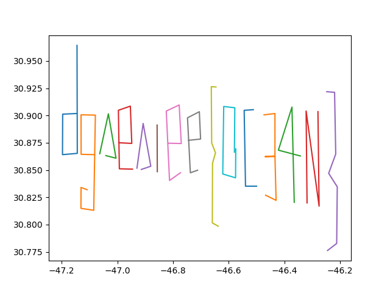

# Sous l'océan

---

## Description

Nous pensons avoir retrouvé la trace d'Eve Descartes. Nous avons reçu un fichier anonyme provenant d'un smartphone Android (probablement celui de son ravisseur). Retrouvez des informations dans son historique de position.

Le flag est de la forme DGSESIEE{x} avec x une chaine de caractères

## Resources

* [memdump.txt](Sous_l'ocean/memdump.txt)

## Resolution

First of all, we have to find informations about the position. We can try to grep with some key words : map, geo, gps...

```bash
cat memdump.txt | grep gps -A2 -B2
```

And bingo ! This looks great.

```txt
Custom Location History :
  Custom Location 1
                gps: Location[gps -47,1462046   30,9018186 hAcc=20 et=??? alt=0.0 vel=0.0 bear=0.0 vAcc=??? sAcc=??? bAcc=??? {Bundle[{satellites=0, maxCn0=0, meanCn0=0}]}]
                gps: Location[gps -47,1963297   30,9012294 hAcc=20 et=??? alt=0.0 vel=0.0 bear=0.0 vAcc=??? sAcc=??? bAcc=??? {Bundle[{satellites=0, maxCn0=0, meanCn0=0}]}]
                gps: Location[gps -47,1970164   30,8641039 hAcc=20 et=??? alt=0.0 vel=0.0 bear=0.0 vAcc=??? sAcc=??? bAcc=??? {Bundle[{satellites=0, maxCn0=0, meanCn0=0}]}]
                gps: Location[gps -47,1438013   30,8652827 hAcc=20 et=??? alt=0.0 vel=0.0 bear=0.0 vAcc=??? sAcc=??? bAcc=??? {Bundle[{satellites=0, maxCn0=0, meanCn0=0}]}]
                gps: Location[gps -47,1448313   30,9642508 hAcc=20 et=??? alt=0.0 vel=0.0 bear=0.0 vAcc=??? sAcc=??? bAcc=??? {Bundle[{satellites=0, maxCn0=0, meanCn0=0}]}]
        Custom Location 2
                gps: Location[gps -47,0820032   30,8641039 hAcc=20 et=??? alt=0.0 vel=0.0 bear=0.0 vAcc=??? sAcc=??? bAcc=??? {Bundle[{satellites=0, maxCn0=0, meanCn0=0}]}]
                gps: Location[gps -47,1300684   30,8643986 hAcc=20 et=??? alt=0.0 vel=0.0 bear=0.0 vAcc=??? sAcc=??? bAcc=??? {Bundle[{satellites=0, maxCn0=0, meanCn0=0}]}]
                gps: Location[gps -47,1304118   30,9006402 hAcc=20 et=??? alt=0.0 vel=0.0 bear=0.0 vAcc=??? sAcc=??? bAcc=??? {Bundle[{satellites=0, maxCn0=0, meanCn0=0}]}]
                gps: Location[gps -47,0789133   30,9003456 hAcc=20 et=??? alt=0.0 vel=0.0 bear=0.0 vAcc=??? sAcc=??? bAcc=??? {Bundle[{satellites=0, maxCn0=0, meanCn0=0}]}]
                gps: Location[gps -47,0847498   30,8131067 hAcc=20 et=??? alt=0.0 vel=0.0 bear=0.0 vAcc=??? sAcc=??? bAcc=??? {Bundle[{satellites=0, maxCn0=0, meanCn0=0}]}]
                gps: Location[gps -47,1307551   30,8148758 hAcc=20 et=??? alt=0.0 vel=0.0 bear=0.0 vAcc=??? sAcc=??? bAcc=??? {Bundle[{satellites=0, maxCn0=0, meanCn0=0}]}]
                gps: Location[gps -47,1304118   30,8340395 hAcc=20 et=??? alt=0.0 vel=0.0 bear=0.0 vAcc=??? sAcc=??? bAcc=??? {Bundle[{satellites=0, maxCn0=0, meanCn0=0}]}]
                gps: Location[gps -47,1084391   30,8319759 hAcc=20 et=??? alt=0.0 vel=0.0 bear=0.0 vAcc=??? sAcc=??? bAcc=??? {Bundle[{satellites=0, maxCn0=0, meanCn0=0}]}]

.....

        Custom Location 15
                gps: Location[gps -46.247767 30.921826 hAcc=20 et=??? alt=0.0 vel=0.0 bear=0.0 vAcc=??? sAcc=??? bAcc=??? {Bundle[{satellites=0, maxCn0=0, meanCn0=0}]}]
                gps: Location[gps -46.2196146 30.9212369 hAcc=20 et=??? alt=0.0 vel=0.0 bear=0.0 vAcc=??? sAcc=??? bAcc=??? {Bundle[{satellites=0, maxCn0=0, meanCn0=0}]}]
                gps: Location[gps -46.2154947 30.8646709 hAcc=20 et=??? alt=0.0 vel=0.0 bear=0.0 vAcc=??? sAcc=??? bAcc=??? {Bundle[{satellites=0, maxCn0=0, meanCn0=0}]}]
                gps: Location[gps -46.2409006 30.8469871 hAcc=20 et=??? alt=0.0 vel=0.0 bear=0.0 vAcc=??? sAcc=??? bAcc=??? {Bundle[{satellites=0, maxCn0=0, meanCn0=0}]}]
                gps: Location[gps -46.2100015 30.8346066 hAcc=20 et=??? alt=0.0 vel=0.0 bear=0.0 vAcc=??? sAcc=??? bAcc=??? {Bundle[{satellites=0, maxCn0=0, meanCn0=0}]}]
                gps: Location[gps -46.2120615 30.7827088 hAcc=20 et=??? alt=0.0 vel=0.0 bear=0.0 vAcc=??? sAcc=??? bAcc=??? {Bundle[{satellites=0, maxCn0=0, meanCn0=0}]}]
                gps: Location[gps -46.2450205 30.7762196 hAcc=20 et=??? alt=0.0 vel=0.0 bear=0.0 vAcc=??? sAcc=??? bAcc=??? {Bundle[{satellites=0, maxCn0=0, meanCn0=0}]}]
```

Now we just have to draw the path of each custom location.

```python
import numpy as np
import matplotlib.pyplot as plt

f=open('./gpsinfos','r')
content = f.read()
f.close()

lats = []
lons = []

lines = content.split("\n")
for l in lines:
    if "Custom" in l and len(lats) != 0:
        plt.plot(lats,lons)
        lats = []
        lons = []
    elif "gps: Location" in l:
        tmp = ((l.split("gps ")[1]).split(" hAcc")[0]).split(" ")
        lats = np.append(lats, float(tmp[0].replace(',', '.')))
        i = 1
        while tmp[i] == "" :
            i += 1
        lons = np.append(lons, float(tmp[i].replace(',','.')))

plt.plot(lats,lons)
plt.show()
```

And finaly get :


