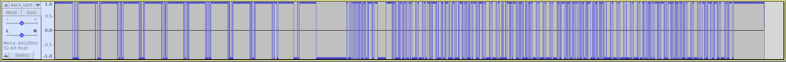
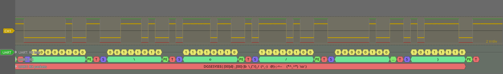

# ASCII UART

---

## Description

Un informateur a intercepté un message binaire transmis sur un câble. Il a rapidement enregistré via la carte son d'un PC les données en 8 bits signés (ascii_uart.raw). Dans la précipitation, il a oublié de noter la fréquence d'échantillonnage. Retrouvez le message.

Le flag est de la forme DGSESIEE{X} avec X le message

## Resources

* [ascii_uart.raw](ASCII_UART/ascii_uart.raw)

## Resolution

>A **universal asynchronous receiver-transmitter** (UART /ˈjuːɑːrt/) is a computer hardware device for asynchronous serial communication in which the data format and transmission speeds are configurable.
>
>Data Framing :
>
>The idle, no data state is high-voltage, or powered. This is a historic legacy from telegraphy, in which the line is held high to show that the line and transmitter are not damaged. Each character is framed as a logic low start bit, data bits, possibly a parity bit and one or more stop bits. In most applications the least significant data bit (the one on the left in this diagram) is transmitted first, but there are exceptions (such as the IBM 2741 printing terminal).
>
> (from wikipedia)

To see how the signal looks like, we can start by openning it with audacity. We have to import raw data and specify the encoding to Signed 8-bit, and select 1 channel.

We apparently have clear signal and we have -128 for 0 and 127 for 1. By zooming at the first few data, we can deduce the frame is consist of 1 bit start, 8 bit data, one bit partity and one bit stop (and ascii using 8 bits).

The first objective we have, is to recover the sample rate.
We just run a little python script to count the number of values between each edge.

```python
f = open("ascii_uart.raw", "rb")
try:
    Y = f.read()
finally:
    f.close()

high = True
tmp = 1
sample = {}

for y in Y:
    if y > 127:
        y = (256-y)*(-1)
    if ( high and y < 0 ) or (not(high) and y > 0 ):
        high = not(high)
        if sample.get(tmp) != None :
            sample[tmp] += 1
        else :
            sample[tmp] = 1
        tmp = 0
    tmp += 1

for k in sorted(sample.keys()):
    print(str(k) + " : " + str(sample[k]))
```

And the result :

```text
638 : 220
1276 : 104
1277 : 1
1914 : 31
2552 : 12
3190 : 7
3826 : 1
3828 : 16
4466 : 1
6380 : 1
8290 : 1
16743 : 5
17378 : 1
17381 : 5
19137 : 1
31888 : 1
```

So we have multiples of 638. That mean the sample frequency is 638 times higher then the baud rate. All we need to do now, is to decode the uart.

### Manually

To decode the uart manually, we will proceed in two steps : get the binary from the raw file and then read data from it.

To get the bits, we just have to get the value at each 638 points.

```python
f = open("ascii_uart.raw", "rb")
try:
    Y = f.read()
finally:
    f.close()

inter = 638
i = int(inter/2)

while i < len(Y):
    y = Y[i]
    if y < 128 :
        print(1, end="")
    else :
        print(0, end="")
    i += inter
```

And then decode it following the protocol.

```python
bits = "111111111111111111111111111111000100010011111111111111111111111111101110001001111111111111111111111111101100101001111111111111111111111111101010001011111111111111111111111111101100101001111111111111111111111111110100110101111111111111111111111111110100100101111111111111111111111111110101000101111111111111111111111111110101000101111111111111111111111111111011011110011111111111111111111111111000000100111111111111111111111111111000000000000000000000000000000000000000000000000001100010011011011011010110101101000101111101001111110000000000000111111111101011010001010111010110010001101100000010011000000100110001110100101111101001000010100010111001000101110010001011110100110100101001101111101001011110100110000001001100000010011000010100010011110101101111101001010110100010100101001100000010011000000100110000001001100000001011010111110010101101000101101110011010110100010101111000101011010001010110100010000001001100000010011000000100010000001001100000010011000010100010010101001100111101011011111010010011110101100101010011010010100110000001001100000010011000111010010111101100101111010011000000100110101111100111111111111111111111111111111111111111111111111111"

pos=0
nbData=8
message=""

while pos < len(bits):

    while bits[pos] == '1': # wating for start bit
        pos += 1
        if pos == len(bits):
            break
    if pos == len(bits):
        break

    pos+=1 #position of the first data bit

    #Getting data
    parity = 0
    b = 0
    for i in range(nbData):
        val = int(bits[pos+i])
        parity += val
        b = b | (val<<i)
    pos += nbData
    parity += int(bits[pos]) # adding parity bit

    pos+=1 #bit stop

    if bits[pos] == '1':
        if parity%2 == 0:
            message += chr(b)

print(message)
```

`DGSESIEE{ d[-_-]b  \_(''/)_/  (^_-)   @}-;---    (*^_^*)  \o/ }`

### Automatically

The second option is to use software like PulseView. Then we import the raw analog data, 8-bit signed and using 638 as sample rate. Next, we have to convert the analog signal into a logical signal and insert a uart decoder. We configure the uart decoder with 8 bit data, with 1-bit odd parity and 1 for baud rate.

And we remove badly received caracters.
