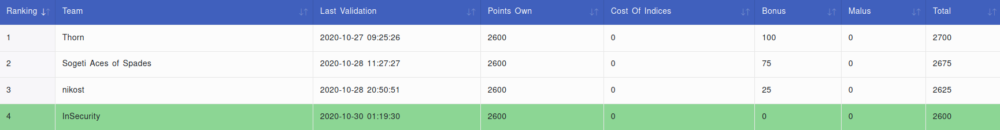

# Brigitte Friang

>2020/10/24 - 2020/11/11

---

I've played this ctf in the Insecurity team and we finished 4th.

## The challenges

### Pwn

* Alone Muks - 100 pts

### Hardware

* [ASCII UART - 100 pts](ASCII_UART.md)
* Keypad Sniffer - 150 pts
* [Evil Cipher - 400 pts](Evil_Cipher.md)

### Stegano

* Le Polyglotte - 150 pts
* Automatos - 300 pts

### Web

* ChatBot - 100 pts

### Misc

* Définition - 50 pts

### Forensic

* [Sous l'océan - 50 pts](Sous_l'ocean.md)
* Steganosaurus - 400 pts

### Crypto

* Le discret Napier - 150 pts
* L'énigme de la crypte - 200 pts
* [Stranger RSA - 200 pts](Stranger_RSA.md)
* VX Elliptique - 250 pts
