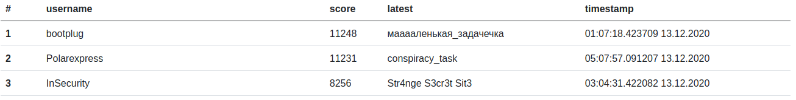

# kksctf open 2020

>2020/12/12 - 2020/12/13

---

I've played this ctf in the InSecurity team and we finished 3th.

## Challenges

### welcome

* [X] intro - 10 pts (215🗸)

### crypto

* [ ] conspiracy_task - 729 pts (5🗸)
* [x] fonction_spéciale - 240 pts (91🗸)
* [ ] Luck_are_not_random - 1000 pts (0🗸)
* [X] not_a_terminator - 523 pts (17🗸)
* [ ] sup - 1000 pts (0🗸)
* [ ] мааааленькая_задачечка - 729 pts (5🗸)

### forensic

* [X] Encrypted Storage 1 - 359 pts (45🗸)
* [X] Encrypted Storage 2 - 367 pts (43🗸)
* [X] Red Green Blue Cadets - 411 pts (33🗸)

### misk

* [X] Blind Shell - 345 pts (49🗸)
* [X] bson - 331 pts (53🗸)
* [X] motor_sounds - 268 pts (77🗸)
* [ ] precious!my - 884 pts (2🗸)

### network

* [X] [Secret Network Part 1](Secret_Network.md) - 729pts (5🗸)
* [X] [Secret Network Part 2](Secret_Network.md) - 729pts (5🗸)

### ppc

* [ ] minesweeper3d - 884 pts (2🗸)

### pwn

* [X] Happy New Year. Part1 - 504 pts (19🗸)
* [X] Happy New Year. Part2 - 556 pts (14🗸)
* [X] Happy New Year. Part3 - 650 pts (8🗸)

### reverse

* [ ] Buterbord - 767 pts (4🗸)
* [ ] Chang3MyBoDy - 1000 pts (0🗸)
* [ ] Loading a reverser - 612 pts (10🗸)
* [X] Yet Another Crypto Task - 513 pts (18🗸)

### web

* [X] hashfunction - 513 pts (18🗸)
* [X] Lynx - 204 pts (113🗸)
* [x] cypherpunk2077 - 392 pts (37🗸)
* [ ] TLS at fingertips - 884 pts (2🗸)
* [X] StrAnge SEcr3t Sit3 - 612 pts (10🗸)
