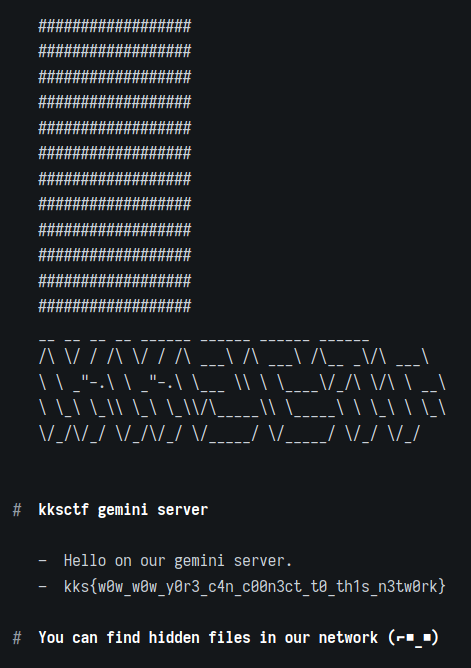
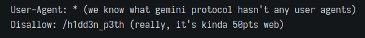
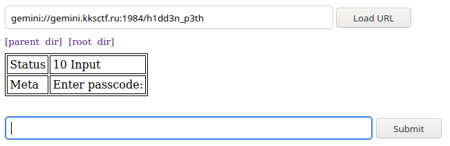
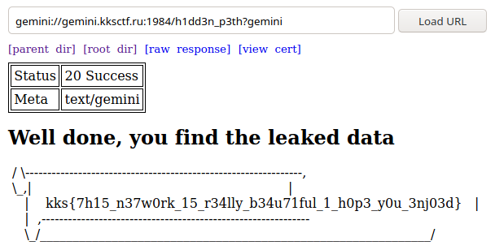

# Secret Network

---

## Part 1

### Description

Our network engineer and his twin brother decided to develop a new secret network. We suspect that they began to leak corporate data using their secret network. We recorded a dump of the network, can you look and search for anything suspicious?

### Ressources

* [task.pcapng](Secret_Network/task.pcapng)

### Solution

We start by opening the file with Wireshark. We discorvered a lot of ARP and TCP traffic. 192.168.122.139 seems to flood ips .1, .115 and .140.By getting rid of all that flood, we can see an interesting conversation between ips .139 and .115, an http connection to .140 by .139 and a TLS connection to 84.201.135.200 by .139.

The conversation:

```txt
$ tshark -r task.pcapng -Y "tcp.flags.push == 1" -T fields -e data | xxd -r -p
hi
good night brother
i get strange message
who send it?
i don't know
But it doesn't matter
It come from our secret network
I put it in our file server
Ok, i will check it
Are there any other leads?
Yes, their server
I found it tomorrow. In OUR network!
gemini.kksctf.ru
I don't know how they get knoweledge about our protocol.
Domain name: gemini.kksctf.ru
Ok, i will visit them
Oh. I hope it's not Big Brother friend...
Please, stop read Orwell every day ._.
```

The HTTP communication (file server):

```txt
GET / HTTP/1.1
Host: 192.168.122.140:8000
User-Agent: curl/7.66.0
Accept: */*

HTTP/1.0 200 OK
Server: SimpleHTTP/0.6 Python/3.7.7
Date: Mon, 07 Dec 2020 23:28:27 GMT
Content-type: text/html; charset=utf-8
Content-Length: 356

<!DOCTYPE HTML PUBLIC "-//W3C//DTD HTML 4.01//EN" "http://www.w3.org/TR/html4/strict.dtd">
<html>
<head>
<meta http-equiv="Content-Type" content="text/html; charset=utf-8">
<title>Directory listing for /</title>
</head>
<body>
<h1>Directory listing for /</h1>
<hr>
<ul>
<li><a href="inventational.txt">inventational.txt</a></li>
</ul>
<hr>
</body>
</html>
```

```txt
GET /inventational.txt HTTP/1.1
Host: 192.168.122.140:8000
User-Agent: curl/7.66.0
Accept: */*

HTTP/1.0 200 OK
Server: SimpleHTTP/0.6 Python/3.7.7
Date: Mon, 07 Dec 2020 23:28:37 GMT
Content-type: text/plain
Content-Length: 164
Last-Modified: Mon, 07 Dec 2020 22:55:26 GMT

HELLO RESEARCHER

YOU ARE WELCOME ON OUR SECRET SERVER

JUST PROOF WHAT YOU ARE NOT A SEARCHING ROBOT AND GET A REWARD

PASSWORD: gemini

BY KKS WITH LOVE AND BEER
```

The TLS communication is the same ip than the domain given by one of the brothers: gemini.kksctf.ru.
We quickly google about gemini: <https://gemini.circumlunar.space/>
There are 2 proxies given on this page, so we used one to check the domain and we get:


---

## Part 2

### Description

And remember, the shark eats everything.

### Solution

This challenge using the same file than the first part. We didn't use the password given in the http connection. There is also something about a searching robot, and the germini site tell us there is some hidden files on it. The first reflex is to check the robots.txt where we get:



We change the directory to go on this new path, but the first proxy seems to not accept to enter a password. So I just change the proxy for the other one on the website.



We can now enter the password and get the flag.


